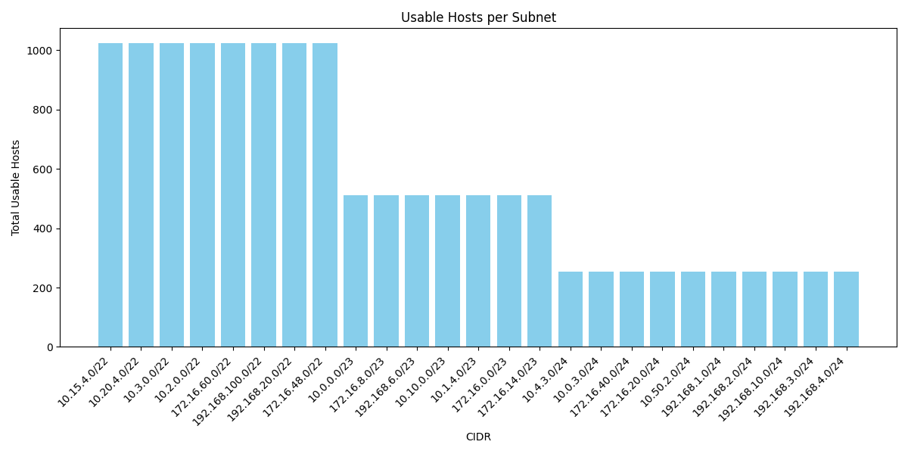

# 🔧 Subnet Analysis and Visualization Tool

This is a DevOps internship project for **Barq Systems**. The tool analyzes and visualizes subnet data using **Python** and **Docker**.

---

## 📁 Files

| File                           | Description                                                     |
| ------------------------------ | --------------------------------------------------------------- |
| `subnet_analyzer.py`           | Main script: performs subnet analysis and generates CSV reports |
| `visualize.py`                 | Script for generating visualizations from the analysis results  |
| `Dockerfile`                   | Docker setup to containerize and automate the tool              |
| `requirements.txt`             | List of required Python libraries for analysis and plotting     |
| `ip_data.xlsx`                 | Input file containing IP addresses and subnet masks             |
| `subnet_report.csv`            | Output: detailed subnet information per IP                      |
| `advanced_grouped_subnets.csv` | Output: summary of IP counts grouped by subnet (CIDR)           |
| `network_plot.png`             | Bar chart: number of IPs per subnet (CIDR)                      |
| `hosts_per_subnet_chart.png`   | Bar chart: total usable hosts per subnet                        |
| `report.md`                    | Project report with analysis documentation and explanations     |

---

## ⚙️ How to Run Locally

1. **Create and activate a virtual environment**:
> **Note:** Using a virtual environment keeps dependencies isolated from your global Python installation, preventing version conflicts and ensuring reproducible results.
   ```bash
   python -m venv venv
   source venv/Scripts/activate      # On Windows
   ```

2. **Install dependencies**:

   ```bash
   pip install -r requirements.txt
   ```

3. **Run the analyzer and generate the chart**:

   ```bash
   python subnet_analyzer.py
   python visualize.py  ```

   Output files will include:

   * `subnet_report.csv`
   * `advanced_grouped_subnets.csv`
   * `hosts_per_subnet_chart.png`

---

## 🐳 Run with Docker

### 1. **Build Docker image**:

```bash
docker build -t subnet-analyzer .
```

### 2. **Run subnet analysis inside container**:

#### ✅ PowerShell / Git Bash:

```bash
docker run -v ${PWD}:/app subnet_analyzer
```

#### ✅ CMD:

```cmd
docker run -v %cd%:/app subnet_analyzer
```

> This will run everything (including the chart generation) and output files will appear in your **local folder**.

---

## 📊 Output

* **subnet_report.csv** → Full subnet analysis (CIDR, usable hosts, etc.)
* **advanced_grouped_subnets.csv** → Count of IPs per subnet
* **hosts_per_subnet_chart.png** → Bar chart showing total usable hosts per subnet

### 📈 Example Visualizations

  
*Bar chart: Total usable hosts per subnet*

---

## 🧰 Tech Stack

| Tool            | Purpose                |
| --------------- | ---------------------- |
| **Python 3.10** | Programming language   |
| **Docker**      | Containerization       |
| **pandas**      | Data processing        |
| **ipaddress**   | IP/subnet calculations |
| **matplotlib**  | Visualization          |
| **openpyxl**    | Read Excel file        |

---

## 📌 Notes

* The tool automatically detects if it is running inside Docker.
* Everything runs in one step — no need to run separate scripts.
* Make sure Docker Desktop is running and WSL is properly set up on Windows.

---

## 📧 Contact

For any questions or feedback, please reach out to **Hazem** at hazem.a.m.bakr@gmail.com.
